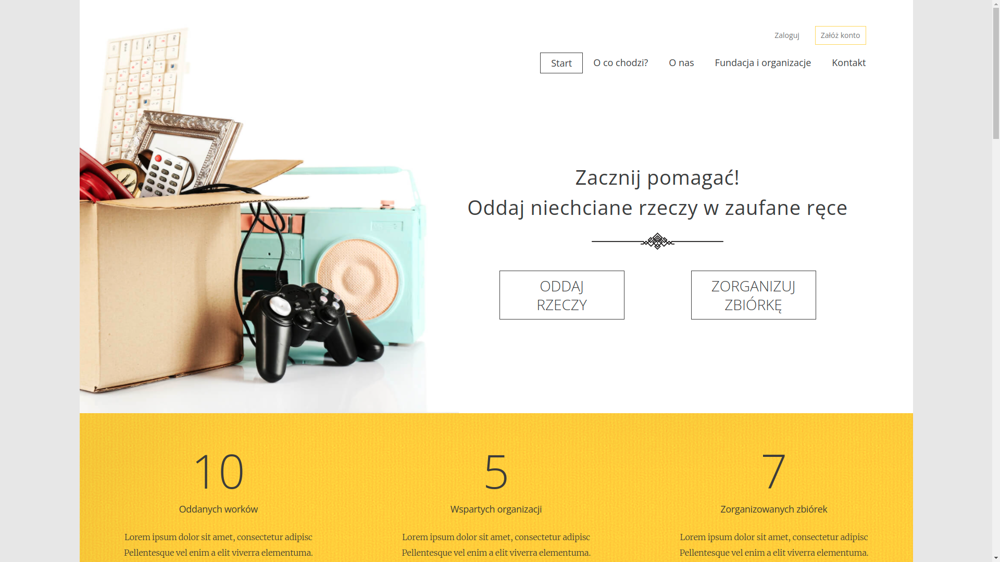
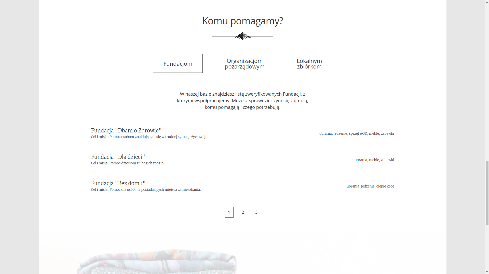
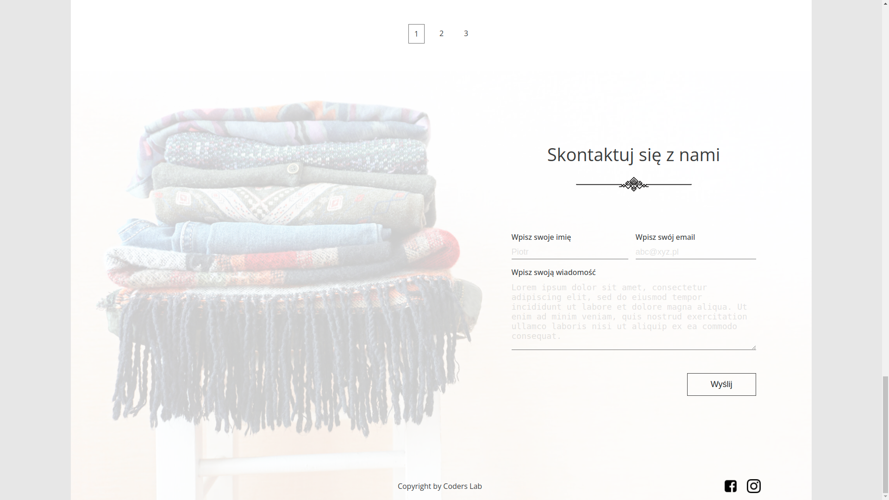
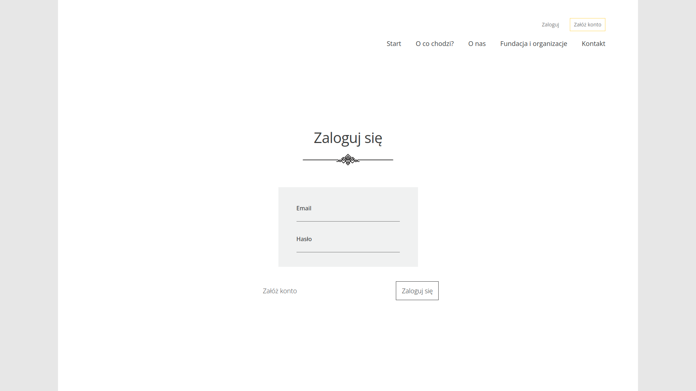

# Donate things

Przykładowa strona internetowa projektu polegającego na oddawaniu niepotrzebnych rzeczy poprzez formularz dostępny po zalogowaniu. Użytkownik ma możliwość założenia konta przy pomocy własnego adresu email. Strona główna zawiera podstawowe informacje o projekcie wraz z formularzem kontaktowym.

An example of a website for the project of donating unnecessary things through a form available after logging in. The user can create an account using their own email address. The home page contains basic information about the project along with a contact form.

## Demo

https://piotrhol.github.io/Donate-things/

## Technologies

React, Sass, Firebase, Redux, React Router, React Scroll, React Hook Form, classnames, dotenv

## Example screenshots

- Main page header

- Fundations and organizations section

- Contact form

- Log in page

- Form available after logging in

This part of website is under construction